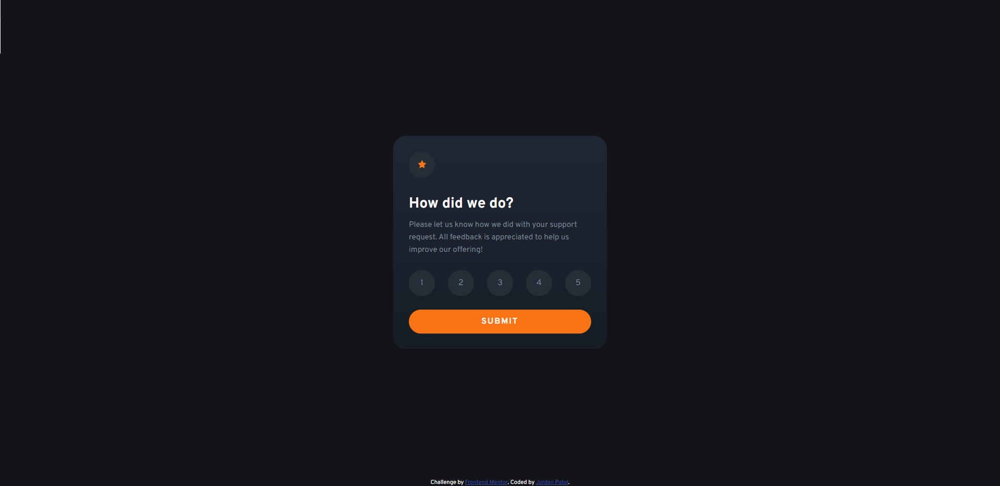

# Frontend Mentor - Interactive rating component solution

This is a solution to the [Interactive rating component challenge on Frontend Mentor](https://www.frontendmentor.io/challenges/interactive-rating-component-koxpeBUmI). Frontend Mentor challenges help you improve your coding skills by building realistic projects. 

A jpg design of the website and a style guide is provided. I then code the site from scratch. 

Difficulty: Level 1 (Newbie)

## Overview

### The challenge

Users should be able to:

- Desktop design only. 
- See hover states for all interactive elements on the page
- Select and submit a number rating
- See the "Thank you" card state after submitting a rating

### Links

- Live Site URL: [https://jordansgit.github.io/interactive-rating-component/](https://jordansgit.github.io/interactive-rating-component/)

### Built with

- HTML5 
- CSS 
- JavaScript

### Screenshot

Desktop 

Thank You Card State

